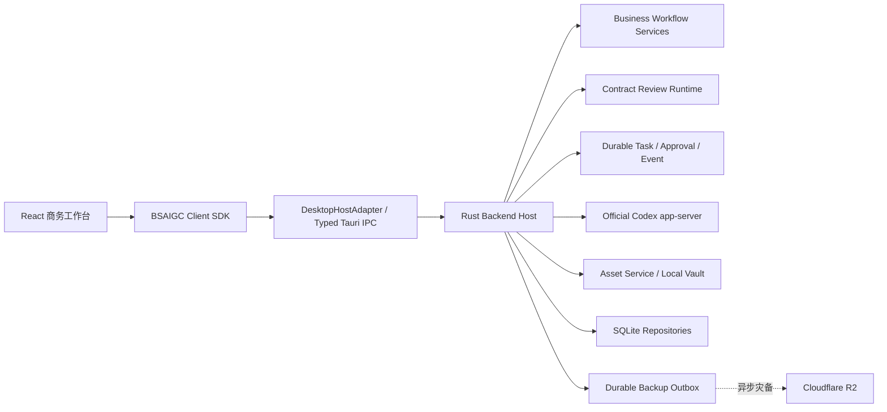
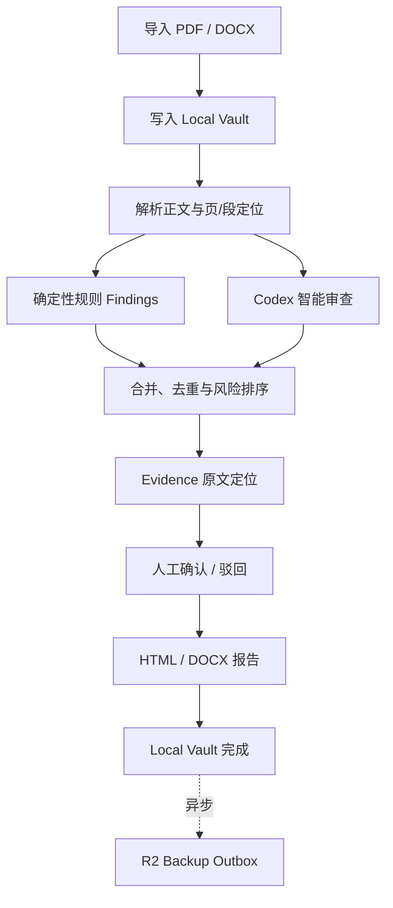

# 半山商务工作台 1.2 架构

> 文档版本：`1.2.0`
> 基准日期：`2026-07-21`
> 当前主线：Windows 桌面商务闭环

## 1. 架构目标

半山商务工作台 1.2 只解决一条业务主线：

```text
客户/项目
→ 需求访谈
→ 报价
→ 合同导入/解析/规则审查/Codex 智能审查
→ Evidence 原文定位
→ 人工确认
→ 报告
→ 请款/付款
→ 验收
→ 到账/回款
→ 台账与归档
```

架构必须保证：

1. 本地成功不依赖网络、Codex 或 R2；
2. 业务数据、任务、资产和人工决策可在重启后恢复；
3. UI 不持有业务权威、密钥或原始文件路径；
4. 智能能力失效时，确定性规则和人工流程仍能闭环；
5. 未来若增加其他 Host，只替换传输和执行位置，不推翻业务协议与 React ViewModel；
6. 1.0 不建设正式网页版、云端业务数据库或第二套 Agent Runtime。

## 2. 总体结构



### 分层职责

| 层 | 负责 | 禁止 |
|---|---|---|
| React UI | 页面、输入、选择、拖拽、轻预览、流式文本与进度 | 直接访问 Tauri、SQLite、文件路径、Provider、Codex、R2 |
| Client SDK | typed command、事件订阅、ViewModel、HostAdapter 抽象 | 建立第二套业务状态或持久化权威 |
| Rust Backend Host | 验证、权限、任务、恢复、Agent、单据、资产、备份和成功判定 | 把密钥、原始路径或内部请求头暴露给 UI |
| SQLite | 业务记录、任务、事件、Receipt、审批、备份状态 | 保存原始 AI/R2 凭据 |
| Local Vault | 合同原件、附件、报告、生成单据和版本文件 | 让 R2 成为主读取源 |
| R2 | 异步灾备、校验后显式恢复 | 决定本地任务成功、充当业务数据库 |
| Codex app-server | Thread、Turn、Tool、Approval 和 Agent 执行 | 取代本地业务规则或人工决策权威 |

## 3. 业务模块

### 3.1 客户、项目与需求

客户和项目提供商务闭环的稳定归属。需求访谈以结构化 Brief 保存目标、交付范围、预算、周期、验收口径、资料缺口和补访状态。已确认 Brief 可为商务工作区提供预填，但不会覆盖用户在目标项目中的显式输入。

### 3.2 报价与商务单据

每个项目最多对应一份商务工作区。工作区集中维护客户、供应方、税务、银行、币种、税率、报价明细、交付条款、付款条款和验收条款。

关键约束：

- 创建工作区时可显式选择同客户历史来源，但 Host 必须重新读取来源并执行客户一致性和字段白名单校验；
- 项目资料和已确认 Requirement Brief 优先于历史预填；
- 报价明细、项目周期、条款、单据、付款和回款不会从历史工作区复制；
- 单据创建时冻结业务快照，后续主数据变化不改写历史文件；
- 报价生成 XLSX，合同、请款和验收生成 DOCX；
- 生成结果先进入 Local Vault，业务表只保存稳定 Asset 外键。

### 3.3 合同审查

合同审查采用“确定性规则 + 官方 Codex app-server + Evidence + 人工确认”的双轨流程：



Findings 必须保留稳定规则编码、严重级别、问题说明、建议和 Evidence 关联。人工决策是最终业务权威；Agent 不得在人工决策后重跑并覆盖结果。

### 3.4 无凭据与 Agent 故障降级

AI 凭据缺失、网络断开、Codex 启动失败或 Turn 执行失败时：

- 已完成的规则 Findings 和 Evidence 必须保留；
- 会话转入 `awaitingConfirmation`，同时记录可重试但不向 UI 暴露敏感内部错误；
- 用户可以继续逐条确认并生成本地 HTML/DOCX 报告；
- 未产生人工决策时允许重试智能审查；
- 已产生人工决策后拒绝 Agent 重跑，防止覆盖人工结论；
- Agent 故障不得把已成功写入 Local Vault 的结果回滚为失败。

### 3.5 请款、验收、到账与回款

付款计划与请款单绑定具体款项记录，并在进入已请款状态后冻结金额、账户和关联单据等核心字段。验收记录关联交付范围、验收口径、验收文件和状态；到账与回款记录关联项目和款项，普通更新不得把已到账或已取消记录回退到早期状态。

台账从本地权威记录汇总项目、合同金额、付款计划、请款、验收、到账、未收款和归档状态，不依赖外部 CRM 或协同系统。

## 4. 本地数据权威

### 4.1 SQLite

SQLite 保存：

- 客户、项目、需求 Brief 和商务工作区；
- 报价、合同、请款、验收、付款和回款元数据；
- 合同审查会话、Findings、Evidence 和人工决策；
- Task Ledger、Event Ledger、Command Receipt、Approval Ledger；
- Asset 元数据、版本、项目归属和 R2 备份/恢复 Receipt。

所有 durable 写命令必须具备：

- `commandId` 或幂等键；
- request fingerprint；
- workspace/resource revision CAS；
- 可重放 Receipt；
- 带 sequence/revision 的领域事件。

### 4.2 Local Vault

Local Vault 保存原始合同、附件、模板、报价、报告、请款、验收文件及其版本。UI 只拿到 `assetId`、文件能力和轻量预览描述，不拿本地绝对路径。

本地文件提交顺序：

```text
临时写入
→ 大小与 SHA-256 校验
→ 原子提交到 Vault
→ SQLite 记录 Asset/Origin
→ 返回稳定 assetId
→ 异步排入 R2 Outbox
```

SQLite 元数据与 Vault 原件共同构成本地业务权威；任何 R2 状态都不能替代本地提交结果。

## 5. R2 异步灾备与恢复

R2 Backup Adapter 只由 Rust Host 调用。React、Client SDK 和业务模块不得持有 R2 密钥、签名请求、对象 URL 或内部请求头。

备份流程：

```text
Local Vault 已完成
→ Durable Backup Outbox 入队
→ 后台 claim / retry / cancel
→ 单次或 Multipart 上传
→ ETag、大小、元数据和 SHA-256 校验
→ SQLite 写入备份 Receipt
```

R2 未配置或上传失败时，本地业务仍保持完成；UI 仅显示“未配置、等待备份、备份中、已备份或可重试”等非敏感状态。

恢复流程：

```text
用户显式选择恢复
→ 下载到 staging
→ 校验 ETag、大小、元数据和 SHA-256
→ 检查本地冲突与项目归属
→ 无覆盖原子提交到 Local Vault
→ SQLite 写入恢复 Receipt
→ 发布 backup.restored Event
```

## 6. 官方 Codex app-server 边界

官方 Codex app-server 是唯一 Agent Runtime。桌面 Host 通过 JSONL stdio 管理 `initialize`、Thread、Turn、Interrupt、Tool 和 Approval 生命周期，并把必要的轻量事件转为 BSAIGC Event。

边界要求：

- 模型与 Thread/项目记忆分离，切换模型不删除业务历史；
- Agent 只能通过注册工具访问业务能力，不能直接修改 SQLite 或 Vault；
- 工具调用必须经过权限、资源归属和必要审批；
- 凭据只在 Rust Host/子进程边界内使用，不返回 UI，不进入业务 SQLite、LocalStorage、日志、诊断或 R2；
- Codex 不可用时，只降级智能审查和聊天，不影响确定性规则、人工确认、报告生成和本地业务操作。

## 7. Command、Event 与 HostAdapter

交互固定为：

```text
用户操作
→ React 组件
→ Client SDK 发出 Command
→ Rust Host 验证并执行
→ Host 持续发布 Event
→ Client SDK 合并为 ViewModel
→ React 更新可见界面
```

协议要求：

- Command/Event 使用纯 JSON 可序列化类型；
- 每个 Command 带 trace、deadline、幂等信息和期望 revision；
- Event 带 sequence/revision，支持断线重放、缺口修复和背压；
- 页面不得直接依赖 SQLite、文件系统或 Tauri `invoke`；
- `DesktopHostAdapter` 是 1.0 唯一实际 Host；
- `WebHostAdapter` 只保留不可用的协议占位和契约测试，1.0 不实现正式网页版、HTTPS/WebSocket Host 或云端业务权威。

## 8. 权限、审批与诊断

- 读、写、生成、批准、恢复和不可逆操作按资源权限检查；
- 不可逆或高影响操作必须进入 Approval Ledger；
- 诊断只记录脱敏错误指纹、阶段和关联 trace，不记录合同全文、凭据、请求头、R2 URL 或本地绝对路径；
- 客户端只上报问题，不允许自动修改、替换或回滚产品代码；
- 单机 1.0 仍以本地操作者为主要信任边界，未来任何云端 Host 都必须重新建立服务端身份和资源授权，不能信任客户端上送身份。

## 9. 失败语义

| 故障 | 1.0 行为 |
|---|---|
| 无 AI 凭据或 Codex 失败 | 保留规则结果和 Evidence，转人工确认，可继续生成本地报告 |
| R2 未配置或上传失败 | 本地成功不变，Outbox 等待配置或重试 |
| 断网 | 本地业务、规则审查、报告和台账继续工作；智能审查与备份降级 |
| 应用重启 | 从 SQLite Ledger、Receipt 和 Vault 恢复任务、会话、资产与状态 |
| 重复提交 | 通过幂等键和 request fingerprint 返回既有 Receipt |
| 陈旧页面写入 | revision CAS 拒绝，要求刷新后重试 |
| 后台任务取消 | 协作取消并持久化终态，不留下“界面已停、后端仍跑”的孤儿任务 |
| 报告已落 Vault、R2 随后失败 | 报告仍为本地完成，只把备份标记为可重试 |

## 10. 1.0 冻结范围

以下能力在 1.2 中保持隐藏或冻结，不是产品主线：

- 创意中心；
- 无限画布；
- 图片、视频、音频媒体生成；
- 销帮帮、飞书和其他外部 CRM/协同系统；
- 正式网页版、D1 业务镜像、团队同步和跨设备协作；
- 第二套 Agent Runtime、业务数据库、任务引擎、权限系统或审批系统。

冻结代码在未完成依赖审计前不做破坏性删除，只允许为共享 Task、Asset、Memory、Security、Client SDK 或 Codex Host 的稳定性进行必要修复。

## 11. Windows 发布边界

- 产品名与窗口标题：`半山商务工作台`；
- 版本：`1.2.0`；
- 发布日期：`2026-07-22`；
- 平台：Windows x64；
- 安装格式：NSIS；
- Codex Runtime：随桌面资源打包并在构建/安装后校验；
- 代码签名：当前没有产品代码签名证书，1.2 NSIS 明确为未签名安装包；
- 安装包 SHA-256：见 [RELEASE_1.2.0.md](RELEASE_1.2.0.md)。
